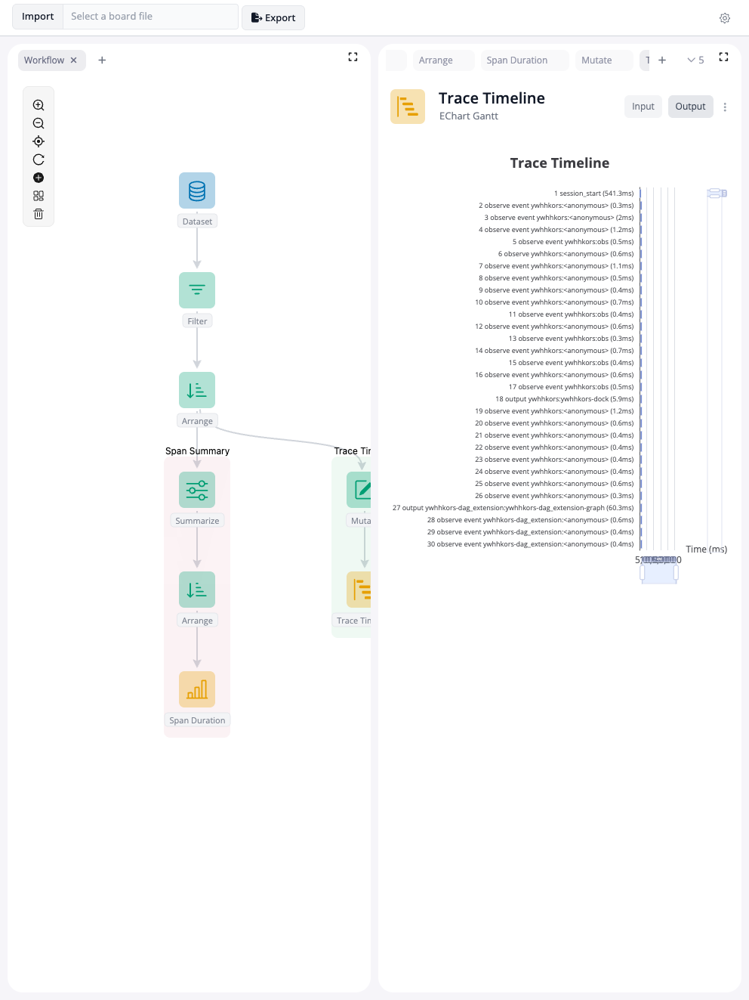

<!-- README.md is generated from README.Rmd. Please edit that file -->

```{r, include=FALSE}
knitr::opts_chunk$set(
  collapse = TRUE,
  comment = "#>",
  fig.path = "man/figures/README-",
  out.width = "100%"
)
```

# blockr.otel

<!-- badges: start -->
[](https://lifecycle.r-lib.org/articles/stages.html#experimental)
<!-- badges: end -->

blockr.otel connects [OpenTelemetry](https://opentelemetry.io/) tracing
to [blockr](https://github.com/BristolMyersSquibb/blockr.core).
It lets you collect spans from one or more Shiny apps and build
interactive analysis workflows on top of the collected data.

The package provides:

- `new_otel_block()`: a block that starts an
  [otel-desktop-viewer](https://github.com/nicholasmckinney/otel-desktop-viewer)
  collector instance, fetches spans periodically, and outputs them as a
  data frame.
- `new_app_driver_block()`: a block that launches a Shiny app via
  [shinytest2::AppDriver](https://rstudio.github.io/shinytest2/reference/AppDriver.html)
  in a background process, so OTEL-instrumented apps can be driven
  headlessly.
- `fetch_spans()` / `rpc_call()`: standalone helpers to pull span data
  from otel-desktop-viewer outside of blockr.
- `otel_spans`: a bundled dataset of 1,397 spans for experimenting
  without running a live collector.

## Installation

You can install the development version of blockr.otel from
[GitHub](https://github.com/) with:

```r
# install.packages("pak")
pak::pak("blockr-org/blockr.otel")
```

## Offline analysis

The package ships with a sample dataset of 1,397 spans (`otel_spans`)
collected from a blockr application session. You can use it to explore
span analysis workflows without setting up a collector.

The example below loads the data through a `new_dataset_block()`,
arranges spans by duration, then branches into two pipelines:

- **Span Summary**: groups spans by name, computes total/average duration
  and count, sorts by total duration, and displays a bar chart.
- **Trace Timeline**: computes time offsets from the earliest span and
  renders a Gantt chart showing the execution timeline.

<details>
<summary>Show code</summary>

```{r offline-example, eval=FALSE, code=readLines("inst/examples/offline-analysis/app.R")}
```

</details>

```{r, echo=FALSE, message=FALSE, warning=FALSE}
Sys.setenv(NOT_CRAN = "true")
# Install so the shinytest2 child process can find blockr.otel
pkgload::load_all(export_all = FALSE, quiet = TRUE)
devtools::install(quick = TRUE, quiet = TRUE, upgrade = "never")
unlink("man/figures/offline-analysis.png")
driver <- shinytest2::AppDriver$new(
  "inst/examples/offline-analysis",
  load_timeout = 60000
)
Sys.sleep(15)
driver$get_screenshot("man/figures/offline-analysis.png")
driver$stop()
```



## Live profiling

The main use case is profiling one or more Shiny apps in real time.
The workflow looks like this:

1. Each `new_app_driver_block()` starts a Shiny app in a background
   process via `shinytest2::AppDriver`. The block configures OTEL
   environment variables so that the app sends traces to the collector.
   A `timeout` parameter controls how long to wait for the app to
   become stable (useful for apps with heavy startup).
2. `new_otel_block()` starts an otel-desktop-viewer instance, polls it
   for new spans, and outputs a consolidated data frame. Multiple app
   drivers can feed into a single collector.
3. Downstream blocks (filter, summarize, arrange, plot) process the
   span data. Since each app has a distinct `service_name`, you can
   split the pipeline per app and compare performance side by side.

The example in `inst/examples/otel-profiler/` demonstrates this with
three apps feeding into one collector, per-app filtering and summary
branches, bar charts, and Gantt timeline views.

<details>
<summary>Show code</summary>

```{r profiler-example, eval=FALSE, code=readLines("inst/examples/otel-profiler/app.R")}
```

</details>

## OTEL setup

If you want to instrument your own apps (outside of the blockr.otel
profiler), you need to configure a few environment variables so that
the [opentelemetry R package](https://github.com/rstudio/opentelemetry)
knows where to send traces.

Add the following to your app's `.Renviron`:

```
OTEL_EXPORTER_OTLP_ENDPOINT="http://localhost:4318"
OTEL_TRACES_EXPORTER="otlp"
OTEL_EXPORTER_OTLP_PROTOCOL="http/protobuf"
OTEL_SERVICE_NAME="my-app"
```

Then start the collector:

```bash
$(go env GOPATH)/bin/otel-desktop-viewer
```

This requires [Go](https://go.dev/) and a one-time install of the
viewer (`go install github.com/nicholasmckinney/otel-desktop-viewer@latest`).
Once the viewer is running, start your app and spans will appear at
<http://localhost:8000/traces>.

## Programmatic usage

You can also fetch spans from a running otel-desktop-viewer
programmatically, without blockr:

```r
library(blockr.otel)

# Fetch all spans as a data frame
spans <- fetch_spans(port = 8000)

# Or call any JSON-RPC method directly
summaries <- rpc_call("getTraceSummaries", port = 8000)
```

`fetch_spans()` calls `getTraceSummaries` to list all traces, then
fetches each trace in parallel with `httr2::req_perform_parallel()` and
assembles the spans into a single data frame with columns like
`traceID`, `spanID`, `name`, `duration_ms`, `service_name`, etc.
