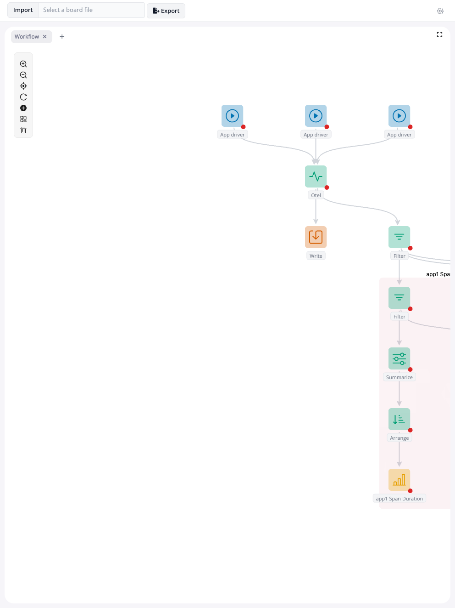

<!-- README.md is generated from README.Rmd. Please edit that file -->

# blockr.otel

<!-- badges: start -->

[](https://lifecycle.r-lib.org/articles/stages.html#experimental)
<!-- badges: end -->

blockr.otel connects [OpenTelemetry](https://opentelemetry.io/) tracing
to [blockr](https://github.com/BristolMyersSquibb/blockr.core). It lets
you collect spans from one or more Shiny apps and build interactive
analysis workflows on top of the collected data.

The package provides:

- `new_otel_block()`: a block that starts an
  [otel-desktop-viewer](https://github.com/nicholasmckinney/otel-desktop-viewer)
  collector instance, fetches spans periodically, and outputs them as a
  data frame.
- `new_app_driver_block()`: a block that launches a Shiny app via
  [shinytest2::AppDriver](https://rstudio.github.io/shinytest2/reference/AppDriver.html)
  in a background process, so OTEL-instrumented apps can be driven
  headlessly.
- `fetch_spans()` / `rpc_call()`: standalone helpers to pull span data
  from otel-desktop-viewer outside of blockr.
- `otel_spans`: a bundled dataset of 1,397 spans for experimenting
  without running a live collector.

## Installation

You can install the development version of blockr.otel from
[GitHub](https://github.com/) with:

``` r
# install.packages("pak")
pak::pak("blockr-org/blockr.otel")
```

## Offline analysis

The package ships with a sample dataset of 1,397 spans (`otel_spans`)
collected from a blockr application session. You can use it to explore
span analysis workflows without setting up a collector.

The example below loads the data through a `new_dataset_block()`,
arranges spans by duration, then branches into two pipelines:

- **Span Summary**: groups spans by name, computes total/average
  duration and count, sorts by total duration, and displays a bar chart.
- **Trace Timeline**: computes time offsets from the earliest span and
  renders a Gantt chart showing the execution timeline.

<details>
<summary>
Show code
</summary>

``` r
# Offline span analysis using the bundled otel_spans dataset.
# No live OTEL collector required.
library(blockr.core)
library(blockr.dock)
library(blockr.dag)
library(blockr.dplyr)
library(blockr.ggplot)
library(blockr.echarts)

serve(
  new_dock_board(
    extensions = new_dag_extension(),
    blocks = list(
      # -- Data source -------------------------------------------------------
      spans = new_dataset_block(
        dataset = "otel_spans",
        package = "blockr.otel"
      ),

      # -- Filter & arrange by duration ----------------------------------------
      spans_filter = new_filter_block(),
      spans_arrange = new_arrange_block(
        state = list(
          columns = list(
            list(column = "duration_ms", direction = "desc")
          )
        )
      ),

      # -- Summary by span name ----------------------------------------------
      spans_summary = new_summarize_block(
        state = list(
          summaries = list(
            list(
              type = "expr",
              name = "total_duration_ms",
              expr = "round(sum(duration_ms, na.rm = TRUE), 2)"
            ),
            list(type = "expr", name = "count", expr = "dplyr::n()"),
            list(
              type = "expr",
              name = "avg_duration_ms",
              expr = "round(mean(duration_ms, na.rm = TRUE), 2)"
            )
          ),
          by = list("name")
        )
      ),
      summary_arrange = new_arrange_block(
        state = list(
          columns = list(
            list(column = "total_duration_ms", direction = "desc")
          )
        )
      ),

      # -- Bar chart of top spans --------------------------------------------
      bar_plot = new_ggplot_block(
        type = "bar",
        x = "total_duration_ms",
        y = "name",
        visible = "outputs",
        block_name = "Span Duration"
      ),

      # -- Gantt timeline ----------------------------------------------------
      gantt_prep = new_mutate_block(
        state = list(
          mutations = list(
            list(
              name = "offset_start",
              expr = "(startTime - min(startTime, na.rm = TRUE)) / 1e6"
            ),
            list(name = "offset_end", expr = "offset_start + duration_ms")
          ),
          by = list()
        )
      ),
      gantt_chart = new_echart_gantt_block(
        start = "offset_start",
        end = "offset_end",
        name = "name",
        span_id = "spanID",
        parent_span_id = "parentSpanID",
        title = "Trace Timeline",
        visible = "outputs",
        block_name = "Trace Timeline"
      )
    ),
    links = list(
      new_link("spans", "spans_filter", "data"),
      new_link("spans_filter", "spans_arrange", "data"),
      # Summary branch
      new_link("spans_arrange", "spans_summary", "data"),
      new_link("spans_summary", "summary_arrange", "data"),
      new_link("summary_arrange", "bar_plot", "data"),
      # Gantt branch
      new_link("spans_arrange", "gantt_prep", "data"),
      new_link("gantt_prep", "gantt_chart", "data")
    ),
    stacks = list(
      new_stack(
        blocks = c("spans_summary", "summary_arrange", "bar_plot"),
        name = "Span Summary"
      ),
      new_stack(
        blocks = c("gantt_prep", "gantt_chart"),
        name = "Trace Timeline"
      )
    )
  )
)
```

</details>

<figure>

<figcaption aria-hidden="true">Offline span analysis</figcaption>
</figure>

## Live profiling

The main use case is profiling one or more Shiny apps in real time. The
workflow looks like this:

1.  Each `new_app_driver_block()` starts a Shiny app in a background
    process via `shinytest2::AppDriver`. The block configures OTEL
    environment variables so that the app sends traces to the collector.
    A `timeout` parameter controls how long to wait for the app to
    become stable (useful for apps with heavy startup).
2.  `new_otel_block()` starts an otel-desktop-viewer instance, polls it
    for new spans, and outputs a consolidated data frame. Multiple app
    drivers can feed into a single collector.
3.  Downstream blocks (filter, summarize, arrange, plot) process the
    span data. Since each app has a distinct `service_name`, you can
    split the pipeline per app and compare performance side by side.

The example in `inst/examples/otel-profiler/` demonstrates this with
three apps feeding into one collector, per-app filtering and summary
branches, bar charts, and Gantt timeline views.

<details>
<summary>
Show code
</summary>

``` r
library(blockr)
library(blockr.bi)
library(blockr.extra)
library(blockr.echarts)
library(blockr.otel)
library(blockr.dplyr)
library(blockr.io)
library(mirai)

# ── Load app paths from config.yml ──────────────────────────────────────────
# Uses the config package (https://rstudio.github.io/config/).
# Copy config.yml.example to config.yml and edit app paths.
config_file <- "config.yml"
if (!file.exists(config_file)) {
  config_file <- system.file(
    "examples/otel-profiler/config.yml",
    package = "blockr.otel"
  )
}
if (!file.exists(config_file)) {
  stop(
    "config.yml not found. Copy config.yml.example to config.yml ",
    "and edit the app paths."
  )
}
apps <- config::get("apps", file = config_file)

# Async mode: span fetching runs in mirai workers,
# shinytest2 (chromote) runs in the main process.
daemons(5)
## automatically shutdown daemons when app exits
shiny::onStop(function() daemons(0))

# ── Build app driver blocks from config ─────────────────────────────────────
app_blocks <- lapply(names(apps), function(id) {
  a <- apps[[id]]
  new_app_driver_block(
    app_dir = a$app_dir,
    timeout = a$timeout %||% 15
  )
})
names(app_blocks) <- names(apps)

# ── Build per-app analysis branches ─────────────────────────────────────────
analysis_blocks <- list()
analysis_links <- list()
analysis_stacks <- list()

for (id in names(apps)) {
  svc <- apps[[id]]$service_name %||% id
  filter_id <- paste0("filter_", id)
  summary_id <- paste0(id, "_summary")
  arrange_id <- paste0(id, "_arrange")
  bar_id <- paste0(id, "_bar_plot")
  gantt_prep_id <- paste0(id, "_gantt_prep")
  gantt_id <- paste0(id, "_gantt_chart")

  analysis_blocks[[filter_id]] <- new_filter_block(
    state = list(
      conditions = list(
        list(
          type = "values",
          column = "service_name",
          values = svc,
          mode = "include"
        )
      ),
      operator = "&"
    )
  )
  analysis_blocks[[summary_id]] <- new_summarize_block(
    state = list(
      summaries = list(
        list(
          type = "expr",
          name = "total_duration_ms",
          expr = "round(sum(duration_ms, na.rm = TRUE), 2)"
        )
      ),
      by = list("name")
    )
  )
  analysis_blocks[[arrange_id]] <- new_arrange_block(
    state = list(
      columns = list(
        list(column = "total_duration_ms", direction = "desc")
      )
    )
  )
  analysis_blocks[[bar_id]] <- new_ggplot_block(
    type = "bar",
    x = "total_duration_ms",
    y = "name",
    visible = "outputs",
    block_name = paste(id, "Span Duration")
  )
  analysis_blocks[[gantt_prep_id]] <- new_mutate_block(
    state = list(
      mutations = list(
        list(
          name = "offset_start",
          expr = "(startTime - min(startTime, na.rm = TRUE)) / 1e6"
        ),
        list(name = "offset_end", expr = "offset_start + duration_ms")
      ),
      by = list()
    )
  )
  analysis_blocks[[gantt_id]] <- new_echart_gantt_block(
    start = "offset_start",
    end = "offset_end",
    name = "name",
    span_id = "spanID",
    parent_span_id = "parentSpanID",
    title = paste(id, "Trace Timeline"),
    visible = "outputs",
    block_name = paste(id, "Trace Timeline")
  )

  analysis_links <- c(analysis_links, list(
    new_link("spans_filter", filter_id, "data"),
    new_link(filter_id, summary_id, "data"),
    new_link(summary_id, arrange_id, "data"),
    new_link(arrange_id, bar_id, "data"),
    new_link(filter_id, gantt_prep_id, "data"),
    new_link(gantt_prep_id, gantt_id, "data")
  ))

  analysis_stacks <- c(analysis_stacks, list(
    new_stack(
      blocks = c(
        filter_id, summary_id, arrange_id, bar_id,
        gantt_prep_id, gantt_id
      ),
      name = paste(id, "Spans")
    )
  ))
}

# ── Assemble the board ──────────────────────────────────────────────────────
all_blocks <- c(
  app_blocks,
  list(
    otel_profiler = new_otel_block(browser_port = 8000L),
    otel_export = new_write_block(format = "parquet", filename = "spans"),
    spans_filter = new_filter_block(
      state = list(
        conditions = list(
          list(type = "expr", expr = "duration_ms >= 0")
        ),
        operator = "&"
      )
    )
  ),
  analysis_blocks
)

app_to_profiler_links <- lapply(names(apps), function(id) {
  new_link(id, "otel_profiler", "")
})

all_links <- c(
  app_to_profiler_links,
  list(
    new_link("otel_profiler", "otel_export", "data"),
    new_link("otel_profiler", "spans_filter", "data")
  ),
  analysis_links
)

serve(
  new_dock_board(
    extensions = new_dag_extension(),
    layout = list(
      list("ext_panel-dag_extension")
    ),
    blocks = all_blocks,
    links = all_links,
    stacks = analysis_stacks
  )
)
```

</details>

<figure>

<figcaption aria-hidden="true">Live profiling</figcaption>
</figure>

## OTEL setup

If you want to instrument your own apps (outside of the blockr.otel
profiler), you need to configure a few environment variables so that the
[opentelemetry R package](https://github.com/rstudio/opentelemetry)
knows where to send traces.

Add the following to your app’s `.Renviron`:

    OTEL_EXPORTER_OTLP_ENDPOINT="http://localhost:4318"
    OTEL_TRACES_EXPORTER="otlp"
    OTEL_EXPORTER_OTLP_PROTOCOL="http/protobuf"
    OTEL_SERVICE_NAME="my-app"

Then start the collector:

``` bash
$(go env GOPATH)/bin/otel-desktop-viewer
```

This requires [Go](https://go.dev/) and a one-time install of the viewer
(`go install github.com/nicholasmckinney/otel-desktop-viewer@latest`).
Once the viewer is running, start your app and spans will appear at
<http://localhost:8000/traces>.

## Programmatic usage

You can also fetch spans from a running otel-desktop-viewer
programmatically, without blockr:

``` r
library(blockr.otel)

# Fetch all spans as a data frame
spans <- fetch_spans(port = 8000)

# Or call any JSON-RPC method directly
summaries <- rpc_call("getTraceSummaries", port = 8000)
```

`fetch_spans()` calls `getTraceSummaries` to list all traces, then
fetches each trace in parallel with `httr2::req_perform_parallel()` and
assembles the spans into a single data frame with columns like
`traceID`, `spanID`, `name`, `duration_ms`, `service_name`, etc.
